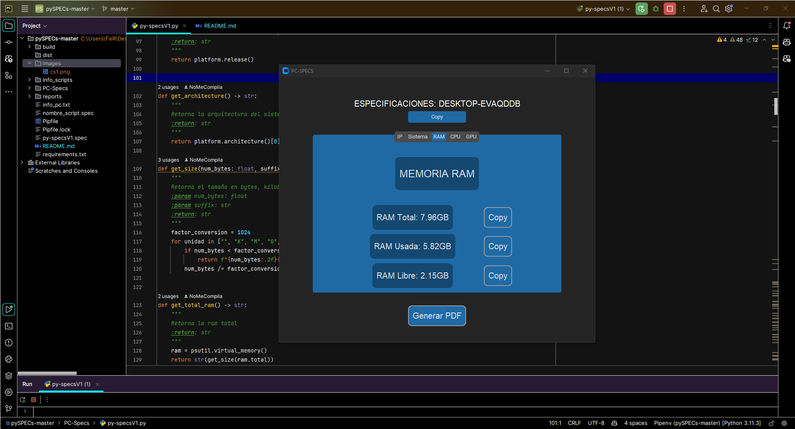

<h1>
<p align="center">
  PC-SPECS
</p>
</h1>

## Descripción del proyecto
Proyecto personal que surge de la necesidad de mejorar mi primer proyecto python en el que me vi involucrado de manera profesional, en concreto es una aplicación de escritorio que detalla las especificaciones de la computadora que estamos utilizando, detalla componentes de hardware como memoria RAM, CPU GPU, etc y también detalles del software del sistema operativo, nombre, distribución y versión. Permite copiar estos datos directamente al portapapeles y permite generar un reporte en PDF con los detalles del mismo

## Lenguajes y librerías utilizadas

<div align="center">
<table>
  <tr>
    <td></td>
    <td></td>
    <td></td>
    <td></td>
  </tr>
  <tr align="center">
    <td>Python 3.11.3</td>
    <td>Jinja2 3.1.2</td>
    <td>pdfkit 1.0.0</td>
    <td>CustomTkinter 5.2.1</td>
  </tr>
    <tr>
    <td></td>
    <td></td>
    <td></td>
    <td></td>
  </tr>
  <tr align="center">
    <td>psutil 5.9.4</td>
    <td>GPUtil 1.4.0</td>
    <td>tabulate 0.9.0</td>
    <td>pyinstaller 6.3.0</td>
  </tr>
</table>
</div>


## Requisitos
- Python 3.x o superior
- Conexión a internet
- descargar e instalar wkhtmltopdf

### Comandos Para Instalar Librerias
- entorno virtual de python
```
pip install pipenv
```
- Jinja2
```
pipenv install Jinja2
```
- pdfkit
```
pipenv install pdfkit
```
- psutil
```
pipenv install psutil
```
- GPUtil
```
pipenv install GPUtil
```
- tabulate
```
pipenv install tabulate
```
- customtkinter
```
pipenv install customtkinter
```
- pyinstaller
```
pipenv install pyinstaller
```

## Información Que Muestra la Aplicación
1) Nombre de la PC
2) Info sobre IP
3) Info memoria RAM 
4) Info memoria en disco
5) GPU
6) CPU
7) Generar reporte PDF
8) Copiar cualquiuer dato de la aplicación

## Instrucciones de uso
Esta aplicación de escritorio es un dashboard que imprime en pantalla los datos de especificaciones de la computadora 
que estemos usando tiene múltiples tabs para dividir por partes la información consultada. Todos los datos se pueden 
copiar al portapapeles rápidamente usando los botones asignados para cada dato. Por último lo más relevante es el botón 
de “Generar PDF” el cual genera un reporte en formato PDF con todas las especificaciones de la computadora en formato 
tabla de manera detallada.

</td>

## Contribuciones
Pueden contactar conmigo directamente en mi correo personal o linkedin, toda mi info de contacto se encuentra en mi github profile, para mejorarlo se necesita actualizar la parte donde se muestra los programas instalados sería un gran aporte añadir un tabview donde se listen todos los programas instalados y añadir un buscador por ejemplo

## Autor
Fernando Caballero - 2024 - Corrientes - Argentina

## Licencia
Free Use
